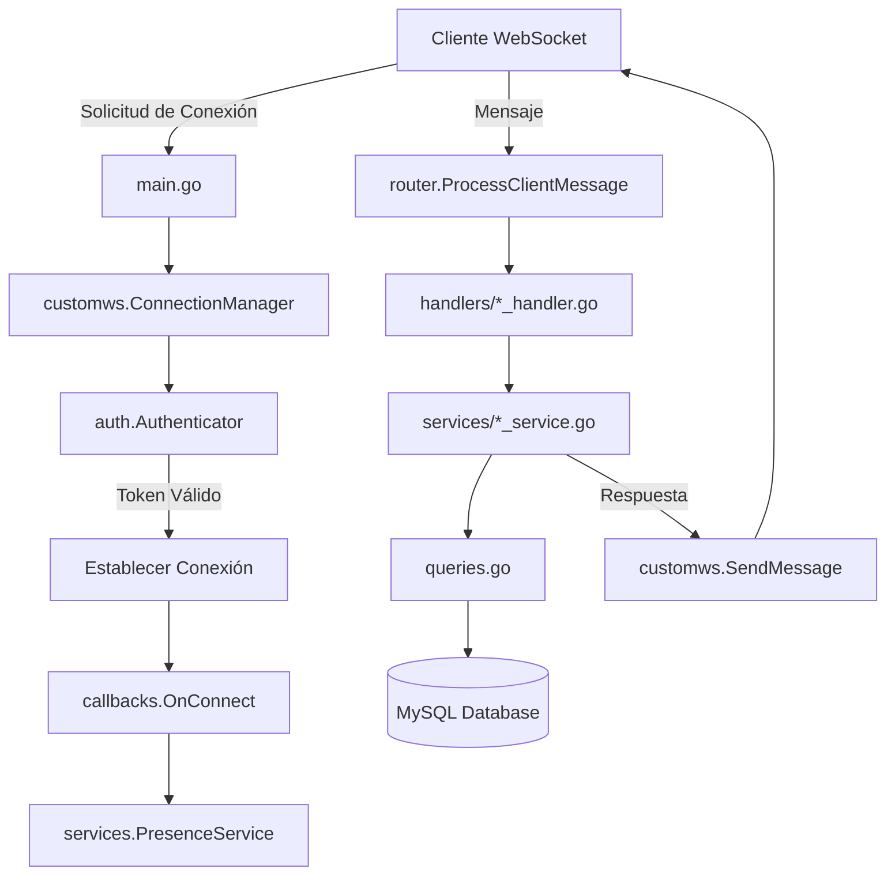

# Documentación del Servidor WebSocket de Chat

## Tabla de Contenidos

1. [Introducción](#1-introducción)
2. [Arquitectura General](#2-arquitectura-general)
3. [Implementación del Paquete customws](#3-implementación-del-paquete-customws)
4. [Flujo de Autenticación WebSocket](#4-flujo-de-autenticación-websocket)
5. [Enrutamiento de Mensajes](#5-enrutamiento-de-mensajes)
6. [Implementación de Handlers](#6-implementación-de-handlers)
7. [Implementación de Servicios](#7-implementación-de-servicios)
8. [Modelos de Datos WebSocket](#8-modelos-de-datos-websocket)
9. [Gestión de Estado Online/Offline](#9-gestión-de-estado-onlineoffline)
10. [Funcionalidad CountryName Detallada](#10-funcionalidad-countryname-detallada)
11. [Consideraciones Avanzadas](#11-consideraciones-avanzadas)

## 1. Introducción

Este documento detalla la arquitectura, implementación y funcionalidades clave del servidor WebSocket desarrollado en Go para la aplicación de chat. El servidor maneja conexiones en tiempo real, autenticación de usuarios, enrutamiento de mensajes y diversas funcionalidades de la aplicación como chat, perfiles, notificaciones y gestión de presencia.

Una pieza central de la gestión de conexiones WebSocket es el paquete `customws`, que proporciona un marco robusto y extensible para manejar clientes WebSocket. Este paquete fue desarrollado específicamente para las necesidades de este proyecto, ofreciendo control granular sobre el ciclo de vida de la conexión y el procesamiento de mensajes.

### Características Principales

- **Gestión de Conexiones en Tiempo Real**: Manejo concurrente y seguro de múltiples conexiones WebSocket
- **Autenticación Robusta**: Sistema de autenticación basado en tokens de sesión
- **Enrutamiento Inteligente**: Sistema de enrutamiento flexible para diferentes tipos de mensajes
- **Gestión de Presencia**: Monitoreo automático del estado online/offline de usuarios
- **Notificaciones Push**: Sistema de notificaciones en tiempo real
- **Arquitectura Modular**: Separación clara de responsabilidades entre capas

## 2. Arquitectura General

El servidor sigue una arquitectura modular, separando responsabilidades en diferentes paquetes y componentes para facilitar el mantenimiento y la escalabilidad:

### 2.1. Estructura de Directorios

```
backend/
├── cmd/websocket/
│   └── main.go                 # Punto de entrada del servidor
├── internal/
│   ├── config/
│   │   └── config.go          # Configuración de la aplicación
│   ├── db/
│   │   ├── db.go              # Conexión y DDL de BD
│   │   └── queries/
│   │       └── queries.go     # Consultas a la base de datos
│   ├── models/
│   │   └── models.go          # Modelos de datos de BD
│   └── websocket/
│       ├── auth/
│       │   └── auth.go        # Autenticación WebSocket
│       ├── handlers/
│       │   ├── chat_handler.go
│       │   ├── profile_handler.go
│       │   └── notification_handler.go
│       ├── services/
│       │   ├── chat_service.go
│       │   ├── presence_service.go
│       │   ├── notification_service.go
│       │   └── profile_service.go
│       ├── wsmodels/
│       │   └── types.go       # DTOs específicos de WebSocket
│       ├── callbacks.go       # Callbacks de customws
│       └── router.go          # Enrutador de mensajes
├── pkg/
│   ├── customws/              # Paquete de gestión WebSocket
│   │   ├── customws.go
│   │   └── types/
│   │       └── types.go
│   └── logger/
│       └── logger.go          # Sistema de logging
```

### 2.2. Flujo de Datos Principal



### 2.3. Componentes Clave

#### `cmd/websocket/main.go`
**Rol**: Punto de entrada de la aplicación del servidor WebSocket.

**Responsabilidades**:
- Carga de variables de entorno (usando `godotenv`)
- Carga de la configuración de la aplicación (`config.LoadConfig`)
- Establecimiento de la conexión a la base de datos MySQL (`db.Connect`)
- Inicialización del esquema de la base de datos (`db.InitializeDatabase`)
- Inicialización de los servicios de la aplicación con inyección de dependencias
- Configuración e instanciación del gestor de conexiones WebSocket (`customws.NewConnectionManager`)
- Registro de los manejadores HTTP (`/ws` y `/health`)
- Arranque del servidor HTTP (`srv.ListenAndServe`)
- Gestión del cierre ordenado (`graceful shutdown`)

#### `internal/config`
**Rol**: Cargar la configuración desde variables de entorno o archivos.

**Contenido Típico**: DSN de la base de datos, puerto del servidor WebSocket, secretos, timeouts, etc.

#### `internal/db`
**Rol**: Manejar la conexión a la base de datos y la inicialización del esquema.

- **`Connect(dsn string)`**: Establece y devuelve una conexión `*sql.DB`
- **`InitializeDatabase(db *sql.DB)`**: Ejecuta el DDL para crear/migrar las tablas necesarias

#### `internal/models`
**Rol**: Definir las estructuras Go que representan las entidades de la aplicación.

**Características**:
- Uso de etiquetas de struct (`json:"..."`, `db:"..."`)
- Manejo de tipos `sql.NullString`, `sql.NullInt64`, `sql.NullTime` para campos nullable
- Mapeo directo a tablas de la base de datos

#### `internal/websocket`
**Rol**: Paquete raíz para toda la lógica específica del WebSocket.

**Subcomponentes**:
- **`auth/`**: Lógica de autenticación para conexiones WebSocket
- **`handlers/`**: Manejo de tipos específicos de mensajes del cliente
- **`services/`**: Lógica de negocio central de la aplicación
- **`wsmodels/`**: DTOs específicos para comunicación WebSocket
- **`callbacks.go`**: Implementación de callbacks para `customws`
- **`router.go`**: Enrutador principal de mensajes WebSocket

## 3. Implementación del Paquete customws

El paquete `customws` es el motor que impulsa la gestión de conexiones WebSocket. Su diseño modular se basa en la configuración, callbacks y estructuras bien definidas.

### 3.1. Propósito y Filosofía de Diseño

`customws` fue concebido para:

- **Abstraer Complejidades**: Ocultar los detalles de bajo nivel del protocolo WebSocket (manejado por `gorilla/websocket`)
- **Proporcionar Concurrencia Segura**: Manejar la lectura y escritura concurrente para cada conexión de manera segura
- **Ser Extensible mediante Callbacks**: Permitir que la lógica de la aplicación se integre limpiamente en puntos clave del ciclo de vida
- **Gestión Centralizada**: Ofrecer un `ConnectionManager` para supervisar y operar sobre todas las conexiones activas
- **Tipado Genérico para Datos de Usuario**: Usar genéricos de Go (`UserData any`) para permitir que la aplicación defina qué datos específicos del usuario se asocian con cada conexión

### 3.2. Componentes Clave

#### ConnectionManager[UserData any]

**Rol**: Orquestador central que mantiene un mapa de todas las conexiones activas.

**Campos Internos Clave**:
```go
type ConnectionManager[UserData any] struct {
    config types.Config
    callbacks Callbacks[UserData]
    clients map[int64]map[*Connection[UserData]]bool
    register chan *Connection[UserData]
    unregister chan *Connection[UserData]
    // ... otros campos internos
}
```

**Métodos Principales**:

- **`NewConnectionManager(config, callbacks)`**: Crea e inicializa el manager
- **`ServeHTTP(w, r)`**: Maneja el handshake HTTP → WebSocket
- **`IsUserOnline(userID int64) bool`**: Verifica si un usuario tiene conexiones activas
- **`SendMessageToUser(userID, message) error`**: Envía mensaje a todas las conexiones de un usuario
- **`GetConnection(userID) (*Connection, bool)`**: Obtiene una conexión específica
- **`Shutdown(ctx) error`**: Cierre ordenado de todas las conexiones

#### Connection[UserData any]

**Rol**: Representa una única conexión WebSocket activa con un cliente.

**Campos Importantes**:
```go
type Connection[UserData any] struct {
    ID int64                        // userID del usuario autenticado
    UserData UserData               // datos del usuario (wsmodels.WsUserData)
    conn *websocket.Conn            // conexión WebSocket de bajo nivel
    manager *ConnectionManager[UserData] // referencia al manager
    send chan []byte                // canal de envío de mensajes
}
```

**Goroutines Asociadas (por conexión)**:
- **`readPump()`**: Lee continuamente mensajes del socket WebSocket
- **`writePump()`**: Lee del canal `send` y escribe al socket WebSocket

**Métodos para la Aplicación**:
- **`SendMessage(message) error`**: Serializa y envía mensaje a esta conexión
- **`SendErrorNotification(pid, code, errorMsg)`**: Envía error estandarizado
- **`Manager()`**: Accede al ConnectionManager (método añadido)

#### Callbacks[UserData any]

Estructura de funciones que define los puntos de extensión:

```go
type Callbacks[UserData any] struct {
    AuthenticateAndGetUserData func(*http.Request) (int64, UserData, error)
    OnConnect                  func(*Connection[UserData]) error
    OnDisconnect              func(*Connection[UserData], error)
    ProcessClientMessage       func(*Connection[UserData], types.ClientToServerMessage) error
    GeneratePID               func() string
}
```

### 3.3. Flujo de Datos y Concurrencia

1. **Lectura (`readPump`)**: Una goroutine por conexión
   - Bloquea leyendo de `websocket.Conn.ReadMessage()`
   - Deserializa y pasa a `ProcessClientMessage`
   - Maneja Pongs y timeouts de lectura

2. **Escritura (`writePump`)**: Una goroutine por conexión
   - Bloquea leyendo del canal `send chan []byte`
   - Escribe en `websocket.Conn.WriteMessage()`
   - Envía Pings periódicos

3. **Gestión Central (`ConnectionManager.run`)**: Una goroutine para el manager
   - Usa `select` para escuchar canales de `register`, `unregister`
   - Mantiene consistencia de los mapas de `clients`

### 3.4. Configuración Típica

```go
wsConfig := types.DefaultConfig()
wsConfig.AllowedOrigins = []string{"*"}
wsConfig.WriteWait = 15 * time.Second
wsConfig.PongWait = 60 * time.Second
wsConfig.PingPeriod = (wsConfig.PongWait * 9) / 10
wsConfig.MaxMessageSize = 4096
wsConfig.SendChannelBuffer = 256
wsConfig.AckTimeout = 10 * time.Second
wsConfig.RequestTimeout = 20 * time.Second
```

## 4. Flujo de Autenticación WebSocket

### 4.1. Proceso de Autenticación Detallado

1. **Solicitud del Cliente**: 
   ```
   WebSocket → /ws?token=AUTH_TOKEN_SESSION_VALIDA
   ```

2. **`customws.ConnectionManager.ServeHTTP`**:
   - Recibe la `http.Request`
   - Llama a `callbacks.AuthenticateAndGetUserData(r)`

3. **`auth.Authenticator.AuthenticateAndGetUserData(r *http.Request)`**:
   ```go
   tokenValue := r.URL.Query().Get("token")
   userModel, err := queries.GetUserBySessionToken(a.db, tokenValue)
   ```

4. **Dentro de `queries.GetUserBySessionToken` (lógica ideal)**:
   ```sql
   -- Paso 1: Verificar sesión
   SELECT UserId, ExpiresAt FROM Session WHERE Tk = ? LIMIT 1
   
   -- Paso 2: Obtener datos del usuario
   SELECT Id, UserName, FirstName, LastName 
   FROM User WHERE Id = ? LIMIT 1
   ```

5. **Construcción de UserData**:
   ```go
   userData := wsmodels.WsUserData{
       ID:        userModel.Id,
       Username:  userModel.UserName,
       FirstName: userModel.FirstName,
       LastName:  userModel.LastName,
   }
   return userModel.Id, userData, nil
   ```

6. **Retorno a `customws.ConnectionManager.ServeHTTP`**:
   - Si `err != nil`: Respuesta HTTP 401 Unauthorized
   - Si `err == nil`: Actualización a WebSocket usando `websocket.Upgrader`
   - Creación del `*customws.Connection` con `userID` y `userData`
   - Registro de la conexión y llamada a `callbacks.OnConnect`

### 4.2. Implementación del Authenticator

```go
type Authenticator struct {
    db *sql.DB
}

func (a *Authenticator) AuthenticateAndGetUserData(r *http.Request) (int64, wsmodels.WsUserData, error) {
    tokenValue := r.URL.Query().Get("token")
    if tokenValue == "" {
        return 0, wsmodels.WsUserData{}, errors.New("token no proporcionado")
    }

    // Extraer "Bearer " si está presente
    if strings.HasPrefix(tokenValue, "Bearer ") {
        tokenValue = strings.TrimPrefix(tokenValue, "Bearer ")
    }

    userModel, err := queries.GetUserBySessionToken(a.db, tokenValue)
    if err != nil {
        return 0, wsmodels.WsUserData{}, fmt.Errorf("token inválido o expirado: %w", err)
    }

    userData := wsmodels.WsUserData{
        ID:        userModel.Id,
        Username:  userModel.UserName,
        FirstName: userModel.FirstName,
        LastName:  userModel.LastName,
    }

    return userModel.Id, userData, nil
}
```

### 4.3. Consideraciones de Seguridad

- **Validación de Token**: Verificación de existencia, validez y expiración
- **Sanitización de Input**: Limpieza del token antes de la consulta SQL
- **Logging de Seguridad**: Registro de intentos de autenticación fallidos
- **Rate Limiting**: Consideración futura para prevenir ataques de fuerza bruta

## 5. Enrutamiento de Mensajes

### 5.1. Router Principal (`router.go`)

El archivo `router.go` implementa el callback `ProcessClientMessage` que actúa como un enrutador central:

```go
func ProcessClientMessage(conn *customws.Connection[wsmodels.WsUserData], msg types.ClientToServerMessage) error {
    logger.Debugf("ROUTER", "Mensaje recibido de UserID %d: Tipo '%s', PID '%s'", 
                  conn.ID, msg.Type, msg.PID)

    switch msg.Type {
    // --- Chat ---
    case types.MessageTypeGetChatList:
        return handlers.HandleGetChatList(conn, msg)
    case types.MessageTypeSendChatMessage:
        return handlers.HandleSendChatMessage(conn, msg)
    
    // --- Perfil ---
    case types.MessageTypeGetMyProfile:
        return handlers.HandleGetMyProfile(conn, msg)
    case types.MessageTypeGetUserProfile:
        return handlers.HandleGetUserProfile(conn, msg)
    
    // --- Notificaciones ---
    case types.MessageTypeGetNotifications:
        return handlers.HandleGetNotifications(conn, msg)
    case types.MessageTypeMarkNotificationRead:
        return handlers.HandleMarkNotificationRead(conn, msg)

    default:
        warnMsg := fmt.Sprintf("Tipo de mensaje no soportado: '%s'", msg.Type)
        logger.Warn("ROUTER", warnMsg)
        return errors.New(warnMsg)
    }
}
```

### 5.2. Tipos de Mensaje Soportados

#### Mensajes Cliente → Servidor
- **Chat**:
  - `GET_CHAT_LIST`: Obtener lista de chats del usuario
  - `SEND_CHAT_MESSAGE`: Enviar mensaje de chat
  - `MESSAGES_READ`: Marcar mensajes como leídos
  - `TYPING_INDICATOR_ON/OFF`: Indicadores de escritura

- **Perfil**:
  - `GET_MY_PROFILE`: Obtener perfil propio
  - `GET_USER_PROFILE`: Obtener perfil de otro usuario
  - `UPDATE_MY_PROFILE`: Actualizar perfil propio

- **Notificaciones**:
  - `GET_NOTIFICATIONS`: Obtener lista de notificaciones
  - `MARK_NOTIFICATION_READ`: Marcar notificación como leída

#### Mensajes Servidor → Cliente
- **Chat**:
  - `CHAT_LIST`: Lista de chats
  - `NEW_CHAT_MESSAGE`: Nuevo mensaje recibido
  - `MESSAGE_STATUS_UPDATE`: Actualización de estado de mensaje

- **Perfil**:
  - `MY_PROFILE_DATA`: Datos del perfil propio
  - `USER_PROFILE_DATA`: Datos del perfil de otro usuario

- **Notificaciones**:
  - `NOTIFICATION_LIST`: Lista de notificaciones
  - `NEW_NOTIFICATION`: Nueva notificación

- **Presencia**:
  - `PRESENCE_EVENT`: Eventos de conexión/desconexión

- **Sistema**:
  - `SERVER_ACK`: Acknowledgment del servidor
  - `ERROR_NOTIFICATION`: Notificación de error

## 6. Implementación de Handlers

### 6.1. Patrón General de Handlers

Todos los handlers siguen un patrón consistente:

```go
func HandleXXX(conn *customws.Connection[wsmodels.WsUserData], msg types.ClientToServerMessage) error {
    // 1. Logging de la solicitud
    logger.Infof("HANDLER_XXX", "Usuario %d solicitó XXX. PID: %s", conn.ID, msg.PID)

    // 2. Decodificación del payload (si aplica)
    type RequestPayload struct {
        Field1 string `json:"field1"`
        Field2 int64  `json:"field2"`
    }
    var payload RequestPayload
    
    if msg.Payload != nil {
        payloadBytes, err := json.Marshal(msg.Payload)
        if err != nil {
            conn.SendErrorNotification(msg.PID, 400, "Error en payload: "+err.Error())
            return err
        }
        if err := json.Unmarshal(payloadBytes, &payload); err != nil {
            conn.SendErrorNotification(msg.PID, 400, "Error decodificando payload: "+err.Error())
            return err
        }
    }

    // 3. Validación del payload
    if payload.Field2 <= 0 {
        conn.SendErrorNotification(msg.PID, 400, "Field2 debe ser mayor que 0")
        return errors.New("validación fallida")
    }

    // 4. Llamada al servicio
    result, err := services.SomeService(conn.ID, payload.Field1, conn.Manager())
    if err != nil {
        logger.Errorf("HANDLER_XXX", "Error en servicio para user %d: %v", conn.ID, err)
        conn.SendErrorNotification(msg.PID, 500, "Error interno: "+err.Error())
        return err
    }

    // 5. Construcción y envío de respuesta
    responseMsg := types.ServerToClientMessage{
        PID:     msg.PID,
        Type:    types.MessageTypeXXXResponse,
        Payload: result,
    }
    if msg.PID == "" {
        responseMsg.PID = conn.Manager().Callbacks().GeneratePID()
    }

    if err := conn.SendMessage(responseMsg); err != nil {
        logger.Errorf("HANDLER_XXX", "Error enviando respuesta a user %d: %v", conn.ID, err)
        return err
    }

    logger.Successf("HANDLER_XXX", "Respuesta enviada a user %d. PID: %s", conn.ID, responseMsg.PID)
    return nil
}
```

### 6.2. Ejemplo: Handler de Perfil

```go
func HandleGetMyProfile(conn *customws.Connection[wsmodels.WsUserData], msg types.ClientToServerMessage) error {
    logger.Infof("HANDLER_PROFILE", "Usuario %d solicitó su propio perfil. PID: %s", conn.ID, msg.PID)

    // No se necesita decodificar payload para "mi perfil"
    profileData, err := services.GetUserProfileData(conn.ID, conn.ID, conn.Manager())
    if err != nil {
        logger.Errorf("HANDLER_PROFILE", "Error obteniendo perfil para user %d: %v", conn.ID, err)
        conn.SendErrorNotification(msg.PID, 500, "Error al obtener tu perfil: "+err.Error())
        return err
    }

    responseMsg := types.ServerToClientMessage{
        PID:     msg.PID,
        Type:    types.MessageTypeMyProfileData,
        Payload: profileData,
    }
    if msg.PID == "" {
        responseMsg.PID = conn.Manager().Callbacks().GeneratePID()
    }

    if err := conn.SendMessage(responseMsg); err != nil {
        logger.Errorf("HANDLER_PROFILE", "Error enviando datos de perfil a user %d: %v", conn.ID, err)
        return err
    }

    logger.Successf("HANDLER_PROFILE", "Datos de perfil enviados a user %d. PID respuesta: %s", conn.ID, responseMsg.PID)
    return nil
}
```

## 7. Implementación de Servicios

### 7.1. Principios de los Servicios

- **Abstracción de la BD**: Usan la capa de `queries` para toda la interacción con la BD
- **Lógica de Negocio Pura**: Se centran en las reglas y flujos de la aplicación
- **Desacoplamiento de WebSocket**: No interactúan directamente con `*websocket.Conn`
- **Inyección de Dependencias**: Reciben `*sql.DB` y `*customws.ConnectionManager` cuando es necesario

### 7.2. Ejemplo: Chat Service

```go
func ProcessAndSaveChatMessage(fromUserID, toUserID int64, text string, 
                              manager *customws.ConnectionManager[wsmodels.WsUserData]) (*models.ChatMessage, error) {
    logger.Infof("SERVICE_CHAT", "Procesando mensaje de UserID %d para UserID %d.", fromUserID, toUserID)

    // 1. Validar que son contactos y obtener ChatID
    var chatID string
    contacts, err := queries.GetAcceptedContacts(chatDB, fromUserID)
    if err == nil {
        for _, c := range contacts {
            if (c.User1Id == fromUserID && c.User2Id == toUserID) || 
               (c.User1Id == toUserID && c.User2Id == fromUserID) {
                chatID = c.ChatId
                break
            }
        }
    }
    if chatID == "" {
        return nil, fmt.Errorf("no se pudo determinar el ChatID para la conversación")
    }

    // 2. Crear y guardar mensaje
    chatMsg := models.ChatMessage{
        ChatID:     chatID,
        FromUserID: fromUserID,
        ToUserID:   toUserID,
        Content:    text,
        CreatedAt:  time.Now().UTC(),
        StatusID:   1, // "sent_to_server"
    }

    if err := queries.CreateChatMessage(chatDB, &chatMsg); err != nil {
        return nil, err
    }

    // 3. Obtener información del remitente
    fromUserConn, fromUserExists := manager.GetConnection(fromUserID)
    var fromUsername = "UsuarioDesconocido"
    if fromUserExists {
        fromUsername = fromUserConn.UserData.Username
    } else {
        userInfo, dbErr := queries.GetUserBaseInfo(chatDB, fromUserID)
        if dbErr == nil && userInfo != nil {
            fromUsername = userInfo.UserName
        }
    }

    // 4. Preparar mensaje para el destinatario
    messageToRecipientPayload := map[string]interface{}{
        "id":           fmt.Sprintf("%d", chatMsg.ID),
        "chatId":       chatMsg.ChatID,
        "fromUserId":   fromUserID,
        "fromUsername": fromUsername,
        "toUserId":     toUserID,
        "text":         text,
        "timestamp":    chatMsg.CreatedAt.UnixMilli(),
    }

    serverMessage := types.ServerToClientMessage{
        PID:     manager.Callbacks().GeneratePID(),
        Type:    types.MessageTypeNewChatMessage,
        Payload: messageToRecipientPayload,
    }

    // 5. Enviar mensaje si el destinatario está online
    if manager.IsUserOnline(toUserID) {
        errSend := manager.SendMessageToUser(toUserID, serverMessage)
        if errSend != nil {
            logger.Warnf("SERVICE_CHAT", "Error enviando mensaje a UserID %d: %v", toUserID, errSend)
        }
        logger.Infof("SERVICE_CHAT", "Mensaje (ID: %d) enviado a UserID %d (online)", chatMsg.ID, toUserID)
    } else {
        logger.Infof("SERVICE_CHAT", "Usuario %d no está online. Mensaje (ID: %d) guardado.", toUserID, chatMsg.ID)
    }

    return &chatMsg, nil
}
```

### 7.3. Inicialización de Servicios

```go
// En main.go
services.InitializeChatService(dbConn)
services.InitializePresenceService(dbConn)
services.InitializeNotificationService(dbConn)
services.InitializeProfileService(dbConn)
```

Cada servicio mantiene su propia referencia a la base de datos:

```go
var chatDB *sql.DB

func InitializeChatService(database *sql.DB) {
    chatDB = database
    logger.Info("SERVICE_CHAT", "ChatService inicializado con conexión a BD.")
}
```

## 8. Modelos de Datos WebSocket

### 8.1. WsUserData

Estructura que se almacena en `Connection.UserData`:

```go
type WsUserData struct {
    ID        int64  `json:"id"`
    Username  string `json:"username"`
    FirstName string `json:"firstName"`
    LastName  string `json:"lastName"`
}
```

### 8.2. DTOs de Payload

#### ChatInfo
```go
type ChatInfo struct {
    ChatID         string `json:"chatId"`
    OtherUserID    int64  `json:"otherUserId"`
    OtherUserName  string `json:"otherUserName"`
    OtherFirstName string `json:"otherFirstName"`
    OtherLastName  string `json:"otherLastName"`
    OtherPicture   string `json:"otherPicture"`
    IsOtherOnline  bool   `json:"isOtherOnline"`
    LastMessage    string `json:"lastMessage"`
    LastMessageTs  int64  `json:"lastMessageTs"`
    UnreadCount    int    `json:"unreadCount"`
}
```

#### NotificationInfo
```go
type NotificationInfo struct {
    ID        string                 `json:"id"`
    Type      string                 `json:"type"`
    Title     string                 `json:"title"`
    Message   string                 `json:"message"`
    Timestamp time.Time              `json:"timestamp"`
    IsRead    bool                   `json:"isRead"`
    Payload   map[string]interface{} `json:"payload,omitempty"`
}
```

#### ProfileData
```go
type ProfileData struct {
    ID                 int64          `json:"id"`
    FirstName          string         `json:"firstName"`
    LastName           string         `json:"lastName"`
    UserName           string         `json:"userName"`
    Email              string         `json:"email"`
    Phone              string         `json:"phone"`
    // ... más campos básicos ...
    IsOnline           bool           `json:"isOnline"`
    Curriculum         CurriculumVitae `json:"curriculum"`
}

type CurriculumVitae struct {
    Education      []EducationItem      `json:"education"`
    Experience     []WorkExperienceItem `json:"experience"`
    Certifications []CertificationItem  `json:"certifications"`
    Skills         []SkillItem          `json:"skills"`
    Languages      []LanguageItem       `json:"languages"`
    Projects       []ProjectItem        `json:"projects"`
}
```

## 9. Gestión de Estado Online/Offline

### 9.1. PresenceService

El `PresenceService` maneja automáticamente el estado de presencia del usuario:

#### En `callbacks.go`:
```go
func OnConnect(conn *customws.Connection[wsmodels.WsUserData]) error {
    logger.Infof("CONNECTION", "Usuario conectado: ID %d, Username: %s", 
                 conn.ID, conn.UserData.Username)
    return services.HandleUserConnect(conn.ID, conn.Manager())
}

func OnDisconnect(conn *customws.Connection[wsmodels.WsUserData], err error) {
    logger.Infof("CONNECTION", "Usuario desconectado: ID %d, Username: %s", 
                 conn.ID, conn.UserData.Username)
    services.HandleUserDisconnect(conn.ID, conn.Manager())
}
```

#### En `services/presence_service.go`:
```go
func HandleUserConnect(userID int64, manager *customws.ConnectionManager[wsmodels.WsUserData]) error {
    // 1. Actualizar estado en BD
    if err := queries.SetUserOnlineStatus(presenceDB, userID, true); err != nil {
        return err
    }

    // 2. Obtener lista de contactos
    contactIDs, err := queries.GetUserContactIDs(presenceDB, userID)
    if err != nil {
        return err
    }

    // 3. Notificar contactos online
    presencePayload := map[string]interface{}{
        "userId": userID,
        "event":  "user_online",
    }

    serverMessage := types.ServerToClientMessage{
        PID:     generatePID(),
        Type:    types.MessageTypePresenceEvent,
        Payload: presencePayload,
    }

    for _, contactID := range contactIDs {
        if manager.IsUserOnline(contactID) {
            manager.SendMessageToUser(contactID, serverMessage)
        }
    }

    return nil
}
```

### 9.2. Actualización de BD para Presencia

#### Consulta `SetUserOnlineStatus`:
```sql
INSERT INTO UserStatus (UserId, IsOnline, LastSeen) 
VALUES (?, ?, NOW()) 
ON DUPLICATE KEY UPDATE 
    IsOnline = VALUES(IsOnline), 
    LastSeen = CASE WHEN VALUES(IsOnline) = 0 THEN NOW() ELSE LastSeen END
```

Esta consulta:
- Inserta un registro si es la primera vez que el usuario se conecta
- Actualiza `IsOnline` si ya existe
- Solo actualiza `LastSeen` cuando el usuario se desconecta (`IsOnline = 0`)

## 10. Funcionalidad CountryName Detallada

### 10.1. Problema Original

Los modelos `Education` y `WorkExperience` tenían un campo `CountryId` pero no incluían `CountryName`, requiriendo consultas adicionales para obtener el nombre del país. Esto resultaba en:

- **Múltiples consultas**: Una consulta por país para cada item de educación/experiencia
- **Complejidad en el servicio**: Lógica compleja de mapeo en `GetUserProfileData`
- **Rendimiento subóptimo**: N+1 consultas para obtener nombres de países

### 10.2. Solución Implementada

#### Paso 1: Modificación de Modelos de BD

**Antes:**
```go
type Education struct {
    Id             int64        `json:"id" db:"Id"`
    PersonId       int64        `json:"person_id" db:"PersonId"`
    Institution    string       `json:"institution" db:"Institution"`
    // ...
    CountryId      int64        `json:"country_id" db:"CountryId"`
    // CountryName no existía
}
```

**Después:**
```go
type Education struct {
    Id             int64        `json:"id" db:"Id"`
    PersonId       int64        `json:"person_id" db:"PersonId"`
    Institution    string       `json:"institution" db:"Institution"`
    // ...
    CountryId      int64        `json:"country_id" db:"CountryId"`
    CountryName    string       `json:"country_name,omitempty" db:"CountryName"` // ✅ Nuevo campo
}
```

**Etiqueta `db:"CountryName"`**: Indica a la biblioteca de mapeo SQL cómo vincular este campo con las columnas de las consultas JOIN.

**Etiqueta `json:"country_name,omitempty"`**: Define el nombre del campo JSON y omite el campo si está vacío.

#### Paso 2: Modificación de Consultas con JOIN

**Antes (múltiples consultas):**
```go
// 1. Obtener education items
educationItems, _ := queries.GetEducationItemsForUser(db, personID)

// 2. Para cada item, obtener country name
for i, item := range educationItems {
    country, _ := queries.GetCountryById(db, item.CountryId)
    // Mapear manualmente...
}
```

**Después (una sola consulta con JOIN):**
```go
func GetEducationItemsForUser(db *sql.DB, personID int64) ([]models.Education, error) {
    query := `SELECT e.Id, e.PersonId, e.Institution, e.Degree, e.Campus, 
                     e.GraduationDate, e.CountryId, c.Name as CountryName
              FROM Education e
              LEFT JOIN Country c ON e.CountryId = c.Id
              WHERE e.PersonId = ?`
              
    rows, err := db.Query(query, personID)
    if err != nil {
        return nil, err
    }
    defer rows.Close()

    var items []models.Education
    for rows.Next() {
        var item models.Education
        var countryName sql.NullString
        
        // ✅ Escanear CountryName como sql.NullString
        if err := rows.Scan(&item.Id, &item.PersonId, &item.Institution, 
                           &item.Degree, &item.Campus, &item.GraduationDate, 
                           &item.CountryId, &countryName); err != nil {
            return nil, fmt.Errorf("error escaneando item de educación: %w", err)
        }
        
        // ✅ Asignar el valor de String al campo del struct
        item.CountryName = countryName.String
        items = append(items, item)
    }
    return items, rows.Err()
}
```

**Clave: `sql.NullString`**: Necesario porque `LEFT JOIN` puede devolver `NULL` si no hay país asociado.

#### Paso 3: Simplificación del Servicio

**Antes (mapeo manual complejo):**
```go
func GetUserProfileData(requestingUserID, targetUserID int64, manager *customws.ConnectionManager[wsmodels.WsUserData]) (*wsmodels.ProfileData, error) {
    // ... código básico ...

    // Mapeo complejo para Education
    for _, dbItem := range educationItemsDB {
        // Consulta adicional para obtener country name
        country, err := queries.GetCountryById(profileDB, dbItem.CountryId)
        var countryName = ""
        if err == nil && country != nil {
            countryName = country.Name
        }
        
        profileDto.Curriculum.Education = append(profileDto.Curriculum.Education, wsmodels.EducationItem{
            ID:             dbItem.Id,
            Institution:    dbItem.Institution,
            // ... otros campos ...
            CountryID:      dbItem.CountryId,
            CountryName:    countryName, // Valor obtenido por consulta separada
        })
    }
}
```

**Después (mapeo directo):**
```go
func GetUserProfileData(requestingUserID, targetUserID int64, manager *customws.ConnectionManager[wsmodels.WsUserData]) (*wsmodels.ProfileData, error) {
    // ... código básico ...

    // Mapeo directo para Education
    for _, dbItem := range educationItemsDB {
        profileDto.Curriculum.Education = append(profileDto.Curriculum.Education, wsmodels.EducationItem{
            ID:             dbItem.Id,
            Institution:    dbItem.Institution,
            // ... otros campos ...
            CountryID:      dbItem.CountryId,
            CountryName:    dbItem.CountryName, // ✅ Usar directamente el campo del modelo
        })
    }
}
```

### 10.3. Beneficios de la Implementación

1. **Rendimiento Mejorado**: De N+1 consultas a 1 consulta por sección del currículum
2. **Código Más Limpio**: Eliminación de lógica compleja de mapeo
3. **Menor Latencia**: Menos operaciones de BD resultan en respuestas más rápidas
4. **Mantenibilidad**: Lógica más simple y fácil de entender
5. **Escalabilidad**: Mejor rendimiento con grandes cantidades de datos

### 10.4. Patrón Replicable

Este mismo patrón se aplicó a `WorkExperience` y puede aplicarse a otros modelos que requieran datos relacionados:

```go
// Patrón general para JOINs con nombres
query := `SELECT main.*, related.Name as RelatedName
          FROM MainTable main
          LEFT JOIN RelatedTable related ON main.RelatedId = related.Id
          WHERE main.SomeField = ?`

// En el struct:
type MainModel struct {
    RelatedId   int64  `db:"RelatedId"`
    RelatedName string `db:"RelatedName"` // Campo adicional
}

// En el scan:
var relatedName sql.NullString
err := rows.Scan(/* campos principales */, &relatedName)
model.RelatedName = relatedName.String
```

## 11. Consideraciones Avanzadas

### 11.1. Gestión de Errores

#### Niveles de Error:
1. **Errores de Validación (400)**: Input inválido del cliente
2. **Errores de Autorización (401/403)**: Token inválido o permisos insuficientes
3. **Errores de Base de Datos (500)**: Fallos en consultas SQL
4. **Errores de Sistema (500)**: Fallos de conectividad o recursos

#### Formato Estándar de Error:
```go
conn.SendErrorNotification(msg.PID, errorCode, "Descripción del error")
```

Se envía como:
```json
{
  "pid": "original_pid",
  "type": "ERROR_NOTIFICATION",
  "payload": {
    "code": 400,
    "message": "Descripción del error"
  }
}
```

### 11.2. Logging y Observabilidad

#### Niveles de Log:
- **Debug**: Detalles de flujo de mensajes
- **Info**: Eventos importantes del sistema
- **Success**: Operaciones completadas exitosamente
- **Warn**: Situaciones anómalas pero recuperables
- **Error**: Errores que requieren atención

#### Contexto de Log:
Cada log incluye:
- **Componente**: `HANDLER_CHAT`, `SERVICE_PROFILE`, etc.
- **UserID**: Para trazabilidad por usuario
- **PID**: Para seguimiento de transacciones

### 11.3. Consideraciones de Concurrencia

#### ConnectionManager Thread-Safety:
- `clients map[int64]map[*Connection]bool` protegido por goroutine única
- Canales `register`/`unregister` para comunicación thread-safe
- `SendMessageToUser` usa canales internos para envío seguro

#### Servicios Thread-Safe:
- Todos los servicios son stateless
- Usan conexiones de BD thread-safe (`*sql.DB`)
- Sin estado compartido entre llamadas

### 11.4. Escalabilidad

#### Límites Actuales:
- **Conexiones por Servidor**: Limitado por file descriptors del SO
- **Memoria por Conexión**: ~8KB (buffers WebSocket + estructuras Go)
- **CPU por Mensaje**: Parsing JSON + lógica de BD

#### Estrategias de Escalamiento:
1. **Horizontal**: Múltiples instancias del servidor WebSocket
2. **Load Balancing**: Distribución basada en UserID consistente
3. **Message Queuing**: Redis/RabbitMQ para notificaciones inter-servidor
4. **Database Scaling**: Read replicas, sharding por UserID

### 11.5. Patrones de Extensión

#### Agregar Nuevo Tipo de Mensaje:
1. Definir constante en `types/types.go`
2. Agregar case en `router.go`
3. Implementar handler en `handlers/`
4. Implementar lógica en servicio correspondiente
5. Agregar consultas necesarias en `queries.go`

#### Agregar Nueva Funcionalidad:
1. Definir DTOs en `wsmodels/types.go`
2. Crear nuevo servicio en `services/`
3. Implementar handlers correspondientes
4. Registrar en el router principal
5. Actualizar documentación

### 11.6. Monitoring y Métricas

#### Métricas Recomendadas:
- **Conexiones Activas**: `customws.ConnectionManager.GetActiveConnectionsCount()`
- **Mensajes por Segundo**: Contador en `ProcessClientMessage`
- **Latencia de BD**: Timing en consultas
- **Errores por Tipo**: Contadores por código de error
- **Memoria por Conexión**: Profiling de Go

#### Health Checks:
```go
// En main.go
http.HandleFunc("/health", func(w http.ResponseWriter, r *http.Request) {
    status := map[string]interface{}{
        "status": "ok",
        "active_connections": manager.GetActiveConnectionsCount(),
        "timestamp": time.Now().Unix(),
    }
    w.Header().Set("Content-Type", "application/json")
    json.NewEncoder(w).Encode(status)
})
```

---

## Conclusión

Esta documentación cubre la arquitectura completa del servidor WebSocket, desde la gestión de conexiones de bajo nivel hasta los patrones de servicios de alto nivel. El diseño modular permite extensibilidad mientras mantiene claridad en las responsabilidades de cada componente.

Las modificaciones específicas para `CountryName` demuestran cómo optimizar consultas de BD y simplificar el código del servicio usando patrones de JOIN apropiados. Este enfoque es replicable para otros campos relacionados en el futuro.

El servidor está diseñado para manejar los requisitos de una aplicación de chat moderna mientras mantiene flexibilidad para futuras expansiones de funcionalidad. 